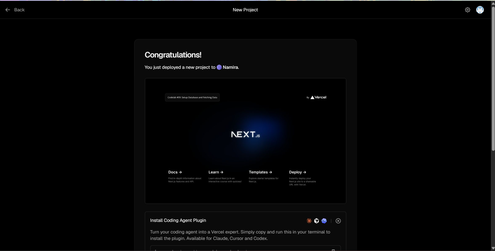
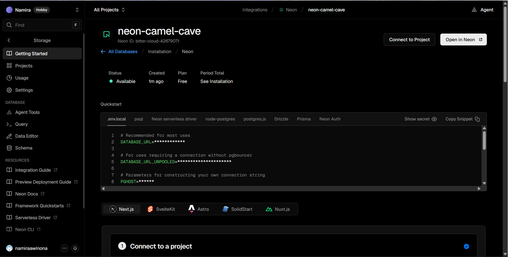
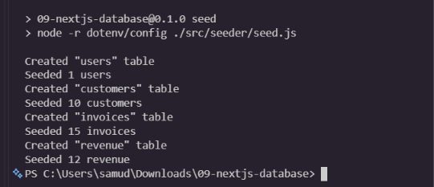
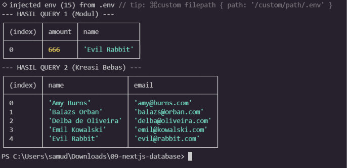

## Soal 1

**Apa yang telah saya pelajari:**
Pada praktikum ini, saya belajar cara meluncurkan (*deploy*) aplikasi Next.js ke internet menggunakan layanan Vercel. Saya memulainya dengan membuat repositori baru dari sebuah *template* starter code, lalu menghubungkan akun GitHub saya dengan Vercel.

Satu hal penting yang saya pelajari adalah fitur integrasi berkelanjutan dari Vercel. Dengan menghubungkan repositori GitHub, setiap kali saya melakukan perubahan ke *main branch*, Vercel akan secara otomatis menerapkan ulang aplikasi saya tanpa memerlukan konfigurasi tambahan. Selain itu, saat membuka *pull requests*, Vercel memberikan pratinjau instan untuk melihat perubahan sebelum digabungkan.
## Soal 2

**Apa yang telah saya pelajari:**
Pada praktikum ini, saya belajar cara membuat dan menghubungkan basis data (*database*) PostgreSQL tanpa server (*serverless*) menggunakan layanan Neon terintegrasi di Vercel. 

Beberapa poin penting yang saya pelajari meliputi:
1. **Penyimpanan Kredensial:** Kredensial koneksi database tidak boleh ditulis langsung di dalam kode. Saya menggunakan fitur *Copy Snippet* dari Vercel dan meletakkannya di dalam file `.env` lokal.
2. **Keamanan dengan `.gitignore`:** Saya memastikan file `.env` masuk ke dalam `.gitignore` agar informasi sensitif seperti URL dan *password* database tidak ikut ter-*push* dan terekspos secara publik di GitHub.
3. **Instalasi SDK:** Saya menginstal paket penghubung via terminal (`@vercel/postgres`) agar aplikasi Next.js dapat berinteraksi langsung dengan basis data menggunakan *query* SQL.
## Soal 3

**Apa yang telah saya pelajari:**
Pada langkah ini, saya mempelajari konsep *Database Seeding*, yaitu proses mengisi basis data yang masih kosong dengan sekumpulan data awal untuk keperluan pengembangan dan pengujian.

Beberapa poin teknis yang saya pahami:
1. **Fungsi Script:** Saya menambahkan perintah `"seed"` di `package.json` yang berfungsi mengeksekusi file `seed.js` menggunakan Node.js.
2. **Penggunaan dotenv:** Terdapat *flag* `-r dotenv/config` pada perintah tersebut. Ini sangat penting agar *script* Node.js dapat membaca "kunci rahasia" koneksi database yang ada di dalam file `.env` lokal sebelum mengeksekusi *query*.
3. **Troubleshooting & Otomatisasi:** Saya belajar mengatasi kendala path file (`./data.js`). Setelah diperbaiki, *script* `seed.js` berhasil menggunakan sintaks SQL untuk membuat struktur tabel secara berurutan dan mengisinya dengan data *dummy* secara otomatis.
## Soal 4

**Query  (Sesuai Modul):**

**Apa yang telah saya pelajari:**
Pada tahap akhir ini, saya belajar cara menjelajahi dan memanipulasi data (*Explore Data*) secara langsung dari *dashboard* basis data menggunakan sintaks SQL.

1. **Eksekusi Query Relasional:** Pada *query* pertama, saya mengeksekusi perintah `JOIN` untuk menggabungkan tabel `invoices` dan `customers`. Ini memungkinkan saya menampilkan nama pelanggan berdasarkan ID mereka yang tercatat di tabel tagihan dengan kondisi jumlah spesifik (`amount = 666`).
2. **Eksplorasi Mandiri:** Pada *query* kreasi sendiri, saya menggunakan perintah `SELECT name, email FROM customers ORDER BY name ASC` untuk mengambil data spesifik (nama dan email) dari tabel pelanggan dan mengurutkannya secara alfabetis. 

Langkah ini membuktikan bahwa data hasil *seeding* sebelumnya sudah masuk ke dalam sistem basis data dan siap ditarik serta dikelola oleh aplikasi Next.js.